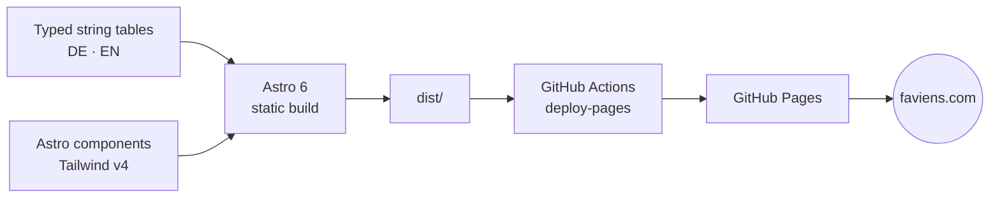

<p align="center">
  
</p>

> Agentic-AI consulting in Zürich, Switzerland.
> Live at **[faviens.com](https://faviens.com)**.

[](https://github.com/faviens/faviens-website/actions)
[](https://faviens.com)
[](https://astro.build)
[](https://tailwindcss.com)
[](https://www.typescriptlang.org)

Static, bilingual (DE / EN) site. Zero JavaScript framework, self-hosted fonts, no third-party tracking. Built with Astro and Tailwind v4, deployed via GitHub Actions to GitHub Pages, served from a custom domain. Fifteen services across three groups, each with its own detail or workshop page, plus about, team and careers, mirrored in both locales.

## Build pipeline



## Stack

| Layer           | Choice                                                              |
| --------------- | ------------------------------------------------------------------- |
| Framework       | [Astro 6](https://astro.build) (static output)                      |
| Styling         | [Tailwind CSS 4](https://tailwindcss.com) via `@tailwindcss/vite`   |
| Fonts           | Self-hosted Archivo Variable ([Fontsource](https://fontsource.org)) |
| i18n            | Astro built-in routing (DE default, EN at `/en/`)                   |
| Sitemap         | `@astrojs/sitemap` with hreflang alternates                         |
| OG image        | Build-time SVG → PNG via `sharp`                                    |
| Type checking   | TypeScript 5 (strict)                                               |
| CI              | GitHub Actions → [`deploy.yml`](.github/workflows/deploy.yml)       |
| Hosting         | GitHub Pages                                                        |
| Runtime (build) | Node 22.12+ (see [`.nvmrc`](.nvmrc))                                |
| Package manager | pnpm 9                                                              |

## Local development

```bash
pnpm install
git config core.hooksPath .githooks   # once per clone, arms the guards
pnpm dev                              # http://localhost:4321
```

Needs Node 22.12+. If you use nvm, `nvm use` picks it up from [`.nvmrc`](.nvmrc);
note that nvm is a shell function, so it only exists in shells that have sourced
`~/.nvm/nvm.sh`. Any Node 22.12+ on `PATH` works without it.

Other scripts:

```bash
pnpm check         # astro check + tsc strict
pnpm build         # produces ./dist
pnpm preview       # serves ./dist locally on :4321
pnpm format        # prettier --write .
pnpm verify        # the full gate, see below
```

## Quality gate

`pnpm verify` ([`scripts/verify.mjs`](scripts/verify.mjs), dependency-free) is
what CI runs and what blocks a merge. It checks the build and strict type-check,
prettier cleanliness, em-dashes, generic credential patterns, terms from a
local-only `.leakwords`, confidential paths that are tracked or staged, and
German/English parity. `pnpm verify --skip-build` is the fast variant.

Secret protection is layered, because on a public repository that deploys on
push, a secret caught after the push is already public:

| Layer                                          | What it does                                                                                                              |
| ---------------------------------------------- | ------------------------------------------------------------------------------------------------------------------------- |
| [`.githooks/pre-commit`](.githooks/pre-commit) | Blocks local-only paths and runs `gitleaks git --staged`. Needs `brew install gitleaks`; degrades to a warning without it |
| [`.githooks/commit-msg`](.githooks/commit-msg) | Blocks commit messages naming a term from `.leakwords`                                                                    |
| [`verify.yml`](.github/workflows/verify.yml)   | `gitleaks` over the **full history** on every PR, plus `pnpm verify`                                                      |
| [`deploy.yml`](.github/workflows/deploy.yml)   | `pnpm verify` again on the deploy path                                                                                    |

`git config core.hooksPath .githooks` is per clone and is not carried in the
repository, so a fresh clone is unprotected until it is run.

See [AGENTS.md](./AGENTS.md) for the full working conventions.

## Environment

Copy [`.env.example`](.env.example) to `.env.local` for local overrides. Production values are injected by GitHub Actions; the only required runtime variable is `SITE_URL` (set in the workflow). `CONTACT_EMAIL` falls back to the address in [`src/data/company.ts`](src/data/company.ts), which is the one place it is defined.

## Project layout

```
public/               static assets (mark.svg, mark-dot.svg, robots, llms.txt, CNAME)
src/
  pages/              .astro routes (DE at /, EN at /en/)
  content/services/   15 services x DE/EN; `track` keys each to a group
  content/team/       one entry per person, plus the portrait
  layouts/            BaseLayout
  components/         Header, Footer, Hero, ContactCTA, GlobeField,
                      ServiceRow, ServiceDetail, WorkshopDetail, Faq, ...
  components/marks/   MarkGlobe, MarkWordmark, MarkLockup
  data/               service groups, workshop and detail routing, FAQ,
                      careers profiles, workshop cities, company facts
  lib/globe.mjs       the mark's geometry (mt19937.mjs under it)
  i18n/               typed string tables (de.ts, en.ts)
  styles/global.css   Tailwind v4 @theme tokens
scripts/              build-time helpers (raster asset generation via sharp)
scripts/assets/       token-templated SVG sources for the icons and OG image
scripts/check-globe.mjs  asserts the generated mark against the artwork of record
.github/workflows/    CI definition
```

## Design system

Source: **Faviens Design Handoff, 2026-08-08**. [AGENTS.md](./AGENTS.md) carries
the full rules and the reasoning; this is the summary.

| Area     | Decision                                                                                                                                                                               |
| -------- | -------------------------------------------------------------------------------------------------------------------------------------------------------------------------------------- |
| Palette  | `--color-paper` `#FDFDFB`, `--color-ink` `#0E0E10`, `--color-grey` `#71716E`, `--color-hair` `#E4E3DE`, accent `#FF000D` / `#D6000B` / `#FF6B73`, tonal ramp `--color-t0`–`--color-t5` |
| Typeface | Archivo, single family. Hierarchy from size, weight and colour only. Never add a second family                                                                                         |
| Layout   | Zürich modernist: strict grid, hairline rules, numbered sections in a 2.5rem left column, copy at 58ch, one accent event per screen                                                    |

Load-bearing rules, each enforced somewhere in the build:

- **Every colour is stated once**, as an rgb triplet, in the `:root` block of
  `src/styles/global.css`. Nothing else in the repository contains a colour.
  The two contexts that cannot resolve a custom property, the `theme-color`
  meta tag and the standalone SVGs, read the tokens rather than repeat them.
- **The accent never sets running text.** It measures 3.9:1 on paper, which
  passes for large text and fails for normal. `--color-accent-d` is 5.3:1 and
  covers anything below the large-text threshold.
- **The mark is generated, not pasted.** `src/lib/globe.mjs` and
  `scripts/generate-og.mjs` write `public/mark*.svg`, the icons and the link
  preview at `predev` and `prebuild`. `scripts/check-globe.mjs` digests the
  result against the committed artwork and `pnpm verify` runs it. The committed
  artwork wins over the generator.
- **The logo is the horizontal lockup**: wound-string globe left, wordmark
  right. The wordmark is FAV, a red bar, ENS; the bar stands in for the I and
  is the mark's only accent event. The `i` stays in the text behind it, so the
  name extracts as "faviens" rather than "favens".
- **Two drawings, not three.** `full` is the mark above 28px, `dot` covers the
  13 to 20px band where bullets live. Icons are PNGs and there is deliberately
  no SVG favicon.
- **The background is the identity**, not decoration: `GlobeField.astro` turns
  the same mark on a canvas, with no dependencies, one static frame under
  `prefers-reduced-motion`, and no loop while the tab is hidden.

Not signed off: the red accent family in place of the handoff's gold, and the
globe and bar wordmark delivered on 2026-09-04. Reverting the palette is the
ten accent and ramp triplets in `global.css` and nothing else.

### Still open

- The name has **not been cleared as a trade mark**: Swissreg classes 9, 35 and
  42, TMview, WIPO. The company name is registered; the mark is a separate
  question.
- **No mobile navigation.** The header nav is `md:` and up, and the footer
  carries legal links only.

## Deployment

`main` is the deploy branch. Every push triggers [`deploy.yml`](.github/workflows/deploy.yml):

1. Install dependencies (pnpm, frozen lockfile)
2. `pnpm verify`, which runs `astro check && astro build`
3. Upload `dist/` as a Pages artifact
4. Publish via `actions/deploy-pages`
5. `smoke`: wait for the live domain to serve this run's commit, then check the real pages

The artifact contains `public/CNAME`, which keeps `faviens.com` wired to the deployment across runs.

### DNS

`faviens.com` is registered at GoDaddy and points at GitHub Pages:

| Type  | Name  | Value                                                                                      |
| ----- | ----- | ------------------------------------------------------------------------------------------ |
| A     | `@`   | `185.199.108.153`, `185.199.109.153`, `185.199.110.153`, `185.199.111.153`                 |
| AAAA  | `@`   | `2606:50c0:8000::153`, `2606:50c0:8001::153`, `2606:50c0:8002::153`, `2606:50c0:8003::153` |
| CNAME | `www` | `faviens.github.io`                                                                        |

`faviens.ch` and `faviens.de` are 301-forwarded to `https://faviens.com` via GoDaddy domain forwarding (no masking). GitHub Pages supports only one custom domain per repository.

## SEO and LLM indexing

- JSON-LD `ProfessionalService` schema on every page
- Sitemap with hreflang alternates (`@astrojs/sitemap`)
- [`public/robots.txt`](public/robots.txt) explicitly allowlists major AI crawlers (Anthropic, OpenAI, Perplexity, Google-Extended, etc.)
- [`public/llms.txt`](public/llms.txt) for LLM-friendly site indexing

## License

Copyright © 2026 Faviens GmbH, Zürich. All rights reserved. See [`LICENSE`](./LICENSE).

Source is published for transparency. No usage, redistribution, or derivative-work rights are granted without explicit written permission.
